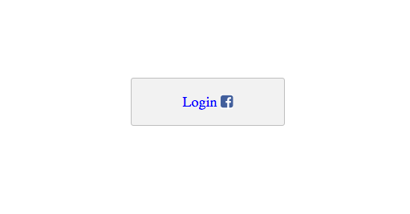

# starterTemplate-Social-Login-API
a Javascript starter template for logging in users with their social account information using the Stamplay Rest API

**CLONING: When cloning this repo, you must initialize the app first to make it work.**

 1) **Initialize the front-end of your app with Stamplay**
 <br>
- Go to your command line and enter **stamplay init**
- When prompted, enter your **appID** & **API Key**

2) **Connect to Facebook**
- Go to **https://developers.facebook.com** and login (sign up for an account if you don't have one)
- Select **My apps** and click on **Add a new app**
- Choose **Website**
- Enter an **app name**
- In the url field, enter **https://[yourAppId].stamplayapp.com**
- Select **Skip to developer dashboard**
- In the Facebook developer dashboard, copy the **AppID** and **App Secret**.
- Go to the Stamplay editor and select **Users**, then **authentication**. Choose **Facebook**
- Paste the **AppId** and **App Secret** directly into the connection field. Click Save.

4) **Configure Facebook app**
- In the Facebook developer dashboard, select **Settings**.
- Under Basic, enter a valid **contact email**.
- Under Advanced, scroll down to the **Valid OAuth redirect URIs** section and enter in **https://[appId].stamplayapp.com/auth/v1/facebook/callback** and **https://localhost:8080/auth/v1/facebook/callback**
- Go to **Status & Review** and under Status click the toggle switch to **Yes** next to the prompt "Do you want to make this app and all its live features available to the general public?"

5) Login
- For signing in with a 3rd party service, you do not need to pass in any password/email information.
```

function facebook(){
	
	window.location.href="https://[yourAppId].stamplayapp.com/auth/v1/facebook/connect";
}
```
6) **Run app**
- To run your app, you'll need to install the Stamplay Command Line Tool. If you have already installed it, ignore this step. Otherwise, enter this command in your command line:
```
$ npm install -g stamplay-cli
```
- If your app is in development, you can run it on your local server by entering **stamplay start** in your command line.
- If your app is in production, you can deploy it live by entering **stamplay deploy** in your command line.


